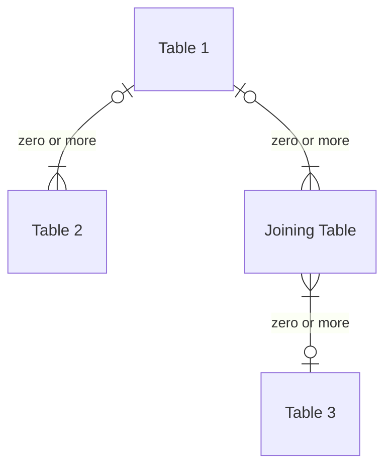

# Intro to SQL Part 2 - Tables, columns, rows & keys

## Building a simple database

### Tables

* A relational database stores data in tables
* Tables are “row based”
* Rows have a primary key

| Row ID | Col 1 | Col 2 | Col 3 |
|--------|-------|-------|-------|
|Row 1|Data 1.1|Data 1.2|Data 1.3|
|Row 2|Data 2.1|Data 2.2|Data 2.3|
|Row 3|Data 3.1|Data 3.2|Data 3.3|
|Row 1|Data 4.1|Data 4.2|Data 4.3|

### Create a table

``` sql
CREATE TABLE <table_1> (
    <column_1>  INT             NOT NULL,
    <column_2>  DATE            NOT NULL,
    <column_3>  VARCHAR(14)     NOT NULL,
    PRIMARY KEY (<column_1>)
);
```

### Table Columns

* One or more columns are the primary key
* Columns have a data type:
  * Numbers (integer, float & more)
  * Strings (char, varchar & more)
  * Dates, times, Time Stamps
  * Boolean values
  * Enumerated lists
* Modern RDMS often support more exotic data types:
  * Large data (Blobs, Clobs)
  * Documents (JSON)
* Columns can be null and have a default
* Primary keys must be unique
* Other columns can have constraints

### Empty columns and null

* Null is a special value used extensively in databases
* It is the absence of a value, rather than an empty string or zero
* It has special tests in SQL and surprising effects: NULL != NULL
* Columns can have a default value

``` sql
CREATE TABLE <table_1> (
    <column_1>  INT             NOT NULL,
    <column_2>  DATE            NOT NULL,
    <column_3>  VARCHAR(14)     NOT NULL,
    PRIMARY KEY (<column_1>)
);
```


## Linking tables

### Tables can have explicit relationships

* A table can have a relationship with many other tables
* The relationship can be one-to-one or one-to-many
* To create a many-to-many relationship you need an additional joining table



### SQL: Create a linked table with a compound key

```sql
CREATE TABLE <table_2> (
    <column_1>  INT         NOT NULL,
    <column_2>  INT         NOT NULL,
    <column_3>  VARCHAR(14) NOT NULL,
    FOREIGN KEY (<column_1>) 
    REFERENCES <table_1> (<column_1),
    PRIMARY KEY (<column_1>, <column_2>)
);
```

### SQL: Create a joining table

```sql
CREATE TABLE <table_3> (
    <column_1>  INT         NOT NULL,
    <column_2>  VARCHAR(14) NOT NULL,
    PRIMARY KEY (<column_1>)
);
```

```sql
CREATE TABLE <table_join> (
    <column_1>  INT         NOT NULL,
    <column_2>  INT         NOT NULL,
    <column_3>  VARCHAR(12) NOT NULL,
    FOREIGN KEY (<column_1>) 
    REFERENCES <table_1> (<column_1),
    FOREIGN KEY (<column_2>) 
    REFERENCES <table_2> (<column_1),
    PRIMARY KEY (<column_1>, <column_2>)
);
```

### Normalising a database schema

* What is important about the database design?
* Are you storing the same information in more than one place?
* Is your structured data stored with types?
