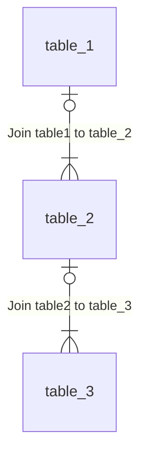
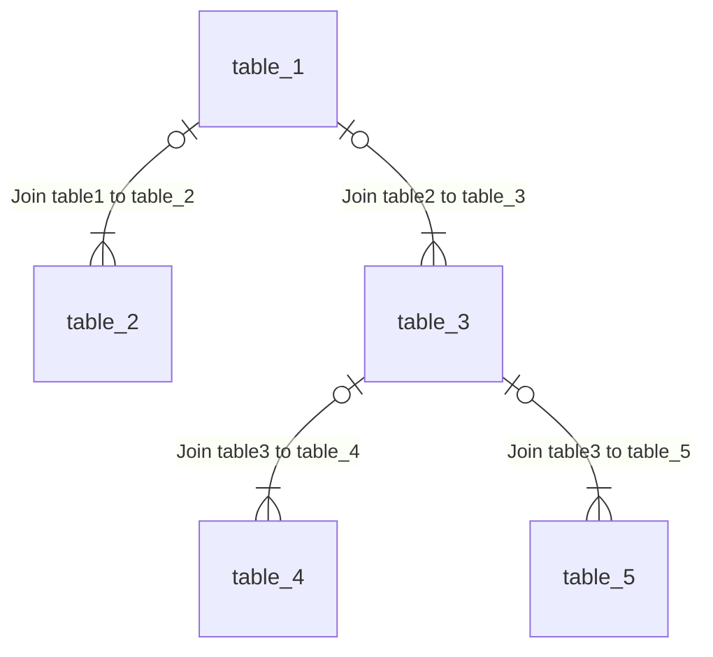
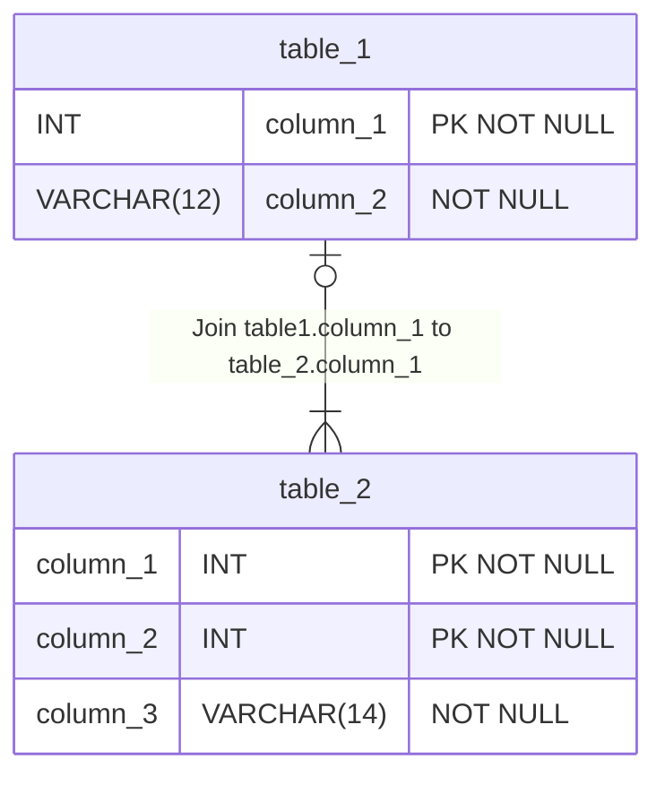

# Intro to SQL Part 3 - SELECT, JOIN, and UNION

## SELECT: Reading from a database table

### SQL: query a single table

``` sql
SELECT
    column_2 AS date_1,
    column_3 AS string_1
FROM
    table_1
WHERE
    column_3 LIKE "Search text%"
AND column_2 = DATE('now');
```

The where clause supports:

* Common comparators (=,<,> etc.)
* Search strings using patterns and wildcards with LIKE
* Check for values that are NULL

### Linking multiple parameters with logical operators

The most common logical operator used in a WHERE clause is AND but others are supported:

* AND,
* OR,
* NOT

You can group statements using braces `()`

``` sql
SELECT
    column_2 AS date_1,
    column_3 AS string_1
FROM
    table_1
WHERE
(
        column_3 LIKE "First search%"
    AND column_2 IS NULL
) OR (
        column_3 LIKE "Second search%"
    AND column_2 IS NOT NULL
);
```

### WHERE clause searching for strings

To search for rows in a table with strings that match a pattern, use LIKE.
Most implementations of LIKE support two wildcard characters: `%` and `_`

* `%` matches any number of characters
* `_` matches any one character

LIKE is usually case-insensitive. Searching for starting sub-strings is often more efficient than
searching for sub-strings in the middle or end of a value.

### WHERE clause searching for ranges

### Modifying data as you retrieve it in a query

The SELECT statement allows you to retrieve data from the database using complex queries.
It also allows you to modify the data as it is retrieved.
Database engines are often very efficient making these changes

You can use the || operator to concatenate columns and text

```sql
SELECT
    column_3 || ' was added on ' || column_2 AS result_1
FROM
    table_1;
```

There are built-in commands to manipulate strings specifically, though they are often specific to
the DBMS.

* LTRIM, RTRIM, TRIM all remove characters from the string
* UPPER, LOWER change the case
* REPLACE, SUBSTR etc.

These manipulations can be used in the WHERE clause:


### SQL: query a table with a sub-query

```sql
SELECT
    column_2 AS col_2
FROM table_1
WHERE col_1 = (
    SELECT
        column_1
    FROM
        table_2
    WHERE
        column_3 LIKE "Unique search%"
);
```

* For this query, your sub-query must return just one result
* You can include multiple sub-queries in the WHERE clause
* You can have multiple levels of sub-query, but nesting can be fragile

## SELECT: Reading from multiple database tables using joins

### Joining tables in a query implicitly

With implicit joins you can:

* Chain tables together to query multiple tables

With explicit joins you can:

* Use an outer join to include rows from one table with no corresponding row in the other table





### SQL: Query two tables with an implicit link

```sql
SELECT
    a.column_1 AS col_1,
    b.column_1 AS col_2
FROM
    table_1 AS a,
    table_2 AS b
WHERE
    a.column_1 = b.column_2;
```



### SQL: Query two tables with an inner join

```sql
SELECT
    a.column_1 AS col_1,
    b.column_1 AS col_2
FROM
    table_1 AS a
INNER JOIN
    table_2 AS b
ON a.column_1 = b.column_2;
```

### SQL: Query two tables with an outer join

```sql
SELECT
    a.column_1 AS col_1,
    b.column_1 AS col_2
FROM
    table_1 AS a
OUTER JOIN
    table_2 AS b
ON a.column_1 = b.column_2;
```

### SQL: store results in a temporary table

```sql
CREATE TEMPORARY TABLE temp_1
SELECT
    a.column_1 AS col_1,
    a.column_2 AS col_2
FROM
    table_1 AS a
WHERE
    a.column_2 LIKE "Search text";
```

* Make sure to name your temporary tables distinctively
* Don’t forget to drop them when you’ve finished
* If the data will be used repeatedly later, consider creating a VIEW

### SQL: query a table and a temporary table using an inner join

You can use temporary tables the same way you use a regular table

```sql
SELECT
    a.column_1 AS col_1,
    b.column_1 AS col_2
FROM
    temp_1 AS a
INNER JOIN
    table_2 AS b
ON a.column_1 = b.column_2;
```

* Performance for temporary tables may be different to regular tables, depending on things like
indexes, size

## UNION & UNION ALL: Combining data from multiple queries
